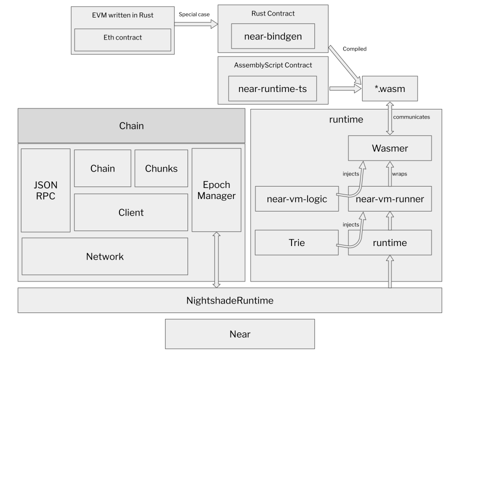

# Overview

This document describes the high-level architecture of nearcore. The focus here
is on the implementation of the blockchain protocol, not the protocol itself.
For reference documentation of the protocol, please refer to
[nomicon](https://nomicon.io/)

Some parts of our architecture are also covered in this [video series on YouTube](https://www.youtube.com/playlist?list=PL9tzQn_TEuFV4qlts0tVgndnytFs4QSYo).

## Bird's Eye View

If we put the entirety of nearcore onto one picture, we get something like this:



Don't worry if this doesn't yet make a lot of sense: hopefully, by the end of
this document the above picture would become much clearer!

## Overall Operation

`nearcore` is a blockchain node -- it's a single binary (`neard`) which runs on
some machine and talks to other similar binaries running elsewhere. Together,
the nodes agree (using a distributed consensus algorithm) on a particular
sequence of transactions. Once transaction sequence is established, each node
applies transactions to the current state. Because transactions are fully
deterministic, each node in the network ends up with identical state. To allow
greater scalability, NEAR protocol uses sharding, which allows a node to hold
only a small subset (shard) of the whole state.

`neard` is a stateful, restartable process. When `neard` starts, the node
connects to the network and starts processing blocks (block is a batch of
transactions, processed together; transactions are batched into blocks for
greater efficiency). The results of processing are persisted in the database.
RocksDB is used for storage. Usually, the node's data is found in the `~/.near`
directory. The node can be stopped at any moment and be restarted later. While
the node is offline it misses the block, so, after a restart, the sync process
kicks in which brings the node up-to-speed with the network by downloading the
missing bits of history from more up-to-date peer nodes.

Major components of nearcore:

* **JSON RPC**. This HTTP RPC interface is how `neard` communicates with
  non-blockchain outside world. For example, to submit a transaction, some
  client sends an RPC request with it to some node in the network. From that
  node, the transaction propagates through the network, until it is included in
  some block. Similarly, a client can send an HTTP request to a node to learn
  about current state of the blockchain. The **JSON RPC** interface is documented
  [here](https://docs.near.org/api/rpc/introduction).

* **Network**. If RPC is aimed "outside" the blockchain, "network" is how peer
  `neard` nodes communicate with each other within the blockchain. RPC carries
  requests from users of the blockchain, while network carries various messages
  needed to implement consensus. Two directly connected nodes communicate by
  sending protobuf-encoded messages over TCP. A node also includes logic to
  route messages for indirect peers through intermediaries. Oversimplifying a
  lot, it's enough for a new node to know an IP address of just one other
  network participant. From this bootstrap connection, the node learns how to
  communicate with any other node in the network.

* **Client**. Somewhat confusingly named, **client** is the logical state of the
  blockchain. After receiving and decoding a request, both **RPC** and **network**
  usually forward it in the parsed form to the **client**. Internally, **client** is
  split in two somewhat independent components: **chain** and **runtime**.

* **Chain**. The job of **chain**, in a nutshell, is to determine a global order of
  transactions. **Chain** builds and maintains the blockchain data structure. This
  includes block and chunk production and processing, consensus, and validator
  selection. However, **chain** is not responsible for actually applying
  transactions and receipts.

* **Runtime**. If **chain** selects the _order_ of transactions, **Runtime** applies
  transaction to the state. **Chain** guarantees that everyone agrees on the order
  and content of transactions, and **Runtime** guarantees that each transaction is
  fully deterministic. It follows that everyone agrees on the "current state" of
  the blockchain. Some transactions are as simple as "transfer X tokens from
  Alice to Bob". But a much more powerful class of transactions is supported:
  "run this arbitrary WebAssembly code in the context of the current state of
  the chain". Running such "smart contract" transactions securely and
  efficiently is a major part of what **Runtime** does. Today, **Runtime** uses a JIT
  compiler to do that.

* **Storage**. **Storage** is more of a cross-cutting concern, than an isolated
  component. Many parts of a node want to durably persist various bits of state
  to disk. One notable case is the logical state of the blockchain, and, in
  particular, data associated with each account. Logically, the state of an account
  on a chain is a key-value map: `HashMap<Vec<u8>, Vec<u8>>`. But there is a
  twist: it should be possible to provide a succinct proof that a particular key
  indeed holds a particular value. To allow that internally the state is
  implemented as a persistent (in both senses, "functional" and "on disk")
  merkle-patricia trie.

* **Parameter Estimator**. One kind of transaction we support is "run this
  arbitrary, Turing-complete computation". To protect from a `loop {}`
  transaction halting the whole network, **Runtime** implements resource limiting:
  each transaction runs with a certain finite amount of "gas", and each
  operation costs a certain amount of gas to perform. **Parameter estimator** is
  essentially a set of benchmarks used to estimate relative gas costs of
  various operations.

## Entry Points

`neard/src/main.rs` contains the main function that starts a blockchain node.
However, this file mostly only contains the logic to parse arguments and
dispatch different commands. `start_with_config` in `nearcore/src/lib.rs` is the
actual entry point and it starts all the actors.

`JsonRpcHandler::process` in the `jsonrpc` crate is the RPC entry point. It
implements the public API of a node, which is documented
[here](https://docs.near.org/api/rpc/introduction).

`PeerManagerActor::spawn` in the `network` is an entry for the other point of
contract with the outside world -- the peer-to-peer network.

`Runtime::apply` in the `runtime` crate is the entry point for transaction
processing logic. This is where state transitions actually happen, after chain
decided, according to distributed consensus, which transitions need  to
happen.

## Code Map

This section contains some high-level overview of important crates and data
structures.

### `core/primitives`

This crate contains most of the types that are shared across different crates.

### `core/primitives-core`

This crate contains types needed for runtime.

### `core/store/trie`

This directory contains the MPT state implementation. Note that we usually use
`TrieUpdate` to interact with the state.

### `chain/chain`

This crate contains most of the chain logic (consensus, block processing, etc).
`ChainUpdate::process_block` is where most of the block processing logic
happens.

**State update**

The blockchain state of a node can be changed in the following two ways:

* Applying a chunk. This is how the state is normally updated: through
  `Runtime::apply`.
* State sync. State sync can happen in two cases:
  * A node is far enough behind the most recent block and triggers state sync to
    fast forward to the state of a very recent block without having to apply
    blocks in the middle.
  * A node is about to become validator for some shard in the next epoch, but it
    does not yet have the state for that shard. In this case, it would run state
    sync through the `catchup` routine.

### `chain/chunks`

This crate contains most of the sharding logic which includes chunk creation,
distribution, and processing. `ShardsManager` is the main struct that
orchestrates everything here.

### `chain/client`

This crate defines two important structs, `Client` and `ViewClient`. `Client`
includes everything necessary for the chain (without network and runtime) to
function and runs in a single thread. `ViewClient` is a "read-only" client that
answers queries without interfering with the operations of `Client`.
`ViewClient` runs in multiple threads.

### `chain/network`

This crate contains the entire implementation of the p2p network used by NEAR
blockchain nodes.

Two important structs here: `PeerManagerActor` and `Peer`. Peer manager
orchestrates all the communications from network to other components and from
other components to network. `Peer` is responsible for low-level network
communications from and to a given peer (more details in
[this article](./network.md#23-peeractor)). Peer manager runs in one thread while each
`Peer` runs in its own thread.

**Architecture Invariant:** Network communicates to `Client` through
`NetworkClientMessages` and to `ViewClient` through `NetworkViewClientMessages`.
Conversely, `Client` and `ViewClient` communicates to network through
`NetworkRequests`.

### `chain/epoch_manager`

This crate is responsible for determining validators and other epoch related
information such as epoch id for each epoch.

**Note:** `EpochManager` is constructed in `NightshadeRuntime` rather than in
`Chain`, partially because we had this idea of making epoch manager a smart
contract.

### `chain/jsonrpc`

This crate implements [JSON-RPC](https://www.jsonrpc.org/) API server to enable
submission of new transactions and inspection of the blockchain data, the
network state, and the node status. When a request is processed, it generates a
message to either `ClientActor` or `ViewClientActor` to interact with the
blockchain. For queries of blockchain data, such as block, chunk, account, etc,
the request usually generates a message to `ViewClientActor`. Transactions, on
the other hand, are sent to `ClientActor` for further processing.

### `runtime/runtime`

This crate contains the main entry point to runtime -- `Runtime::apply`. This
function takes `ApplyState`, which contains necessary information passed from
chain to runtime, a list of `SignedTransaction` and a list of `Receipt`, and
returns a `ApplyResult`, which includes state changes, execution outcomes, etc.

**Architecture Invariant:** The state update is only finalized at the end of
`apply`. During all intermediate steps state changes can be reverted.

### `runtime/near-vm-logic`

`VMLogic` contains all the implementations of host functions and is the
interface between runtime and wasm. `VMLogic` is constructed when runtime
applies function call actions. In `VMLogic`, interaction with NEAR blockchain
happens in the following two ways:

* `VMContext`, which contains lightweight information such as current block
  hash, current block height, epoch id, etc.
* `External`, which is a trait that contains functions to interact with
  blockchain by either reading some nontrivial data, or writing to the
  blockchain.

### `runtime/near-vm-runner`

`run` function in `runner.rs` is the entry point to the vm runner. This function
essentially spins up the vm and executes some function in a contract. It
supports different wasm compilers including wasmer0, wasmer2, and wasmtime
through compile-time feature flags. Currently we use wasmer0 and wasmer2 in
production. The `imports` module exposes host functions defined in
`near-vm-logic` to WASM code. In other words, it defines the ABI of the
contracts on NEAR.

### `neard`

As mentioned before, `neard` is the crate that contains that main entry points.
All the actors are spawned in `start_with_config`. It is also worth noting that
`NightshadeRuntime` is the struct that implements `RuntimeAdapter`.
<!-- TODO: Maybe add RuntimeAdapter mention or explanation in runtime/runtime chapter? -->

### `core/store/src/db.rs`

This file contains the schema (DBCol) of our internal RocksDB storage - a good
starting point when reading the code base.

## Cross Cutting Concerns

### Observability

The [tracing](https://tracing.rs) crate is used for structured, hierarchical
event output and logging. We also integrate [Prometheus](https://prometheus.io)
for light-weight metric output. See the [style](./style.md) documentation for
more information on the usage.

### Testing

Rust has built-in support for writing unit tests by marking functions
with the `#[test]` directive.  Take full advantage of that!  Testing not
only confirms that what was written works the way it was intended to but
also helps during refactoring since it catches unintended behaviour
changes.

Not all tests are created equal though and while some may only need
milliseconds to run, others may run for several seconds or even
minutes.  Tests that take a long time should be marked as such with an
`expensive_tests` feature, for example:

```rust
#[test]
#[cfg_attr(not(feature = "expensive_tests"), ignore)]
fn test_catchup_random_single_part_sync() {
    test_catchup_random_single_part_sync_common(false, false, 13)
}
```

Such tests will be ignored by default and can be executed by using
`--ignored` or `--include-ignored` flag as in `cargo test --
--ignored` or by compiling the tests with `expensive_tests` feature
enabled.

Because expensive tests are not run by default, they are also not run
in CI.  Instead, they are run nightly and need to be explicitly
included in `nightly/expensive.txt` file; for example:

```text
expensive --timeout=1800 near-client near_client tests::catching_up::test_catchup_random_single_part_sync
expensive --timeout=1800 near-client near_client tests::catching_up::test_catchup_random_single_part_sync --features nightly
```

For more details regarding nightly tests see `nightly/README.md`.

Note that what counts as a slow test isn’t exactly defined as of now.
If it takes just a couple seconds than it’s probably fine.  Anything
slower should probably be classified as an expensive test.  In
particular, if libtest complains the test takes more than 60 seconds
than it definitely is and expensive test.
