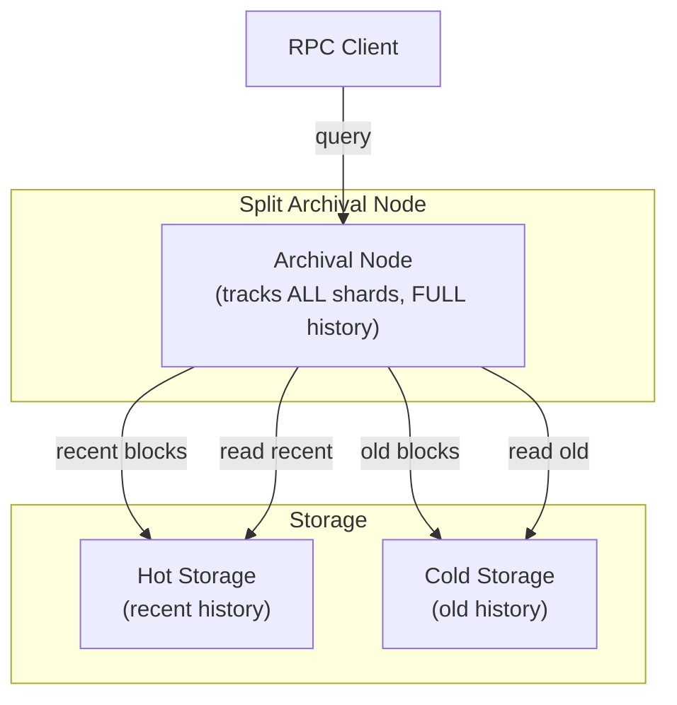
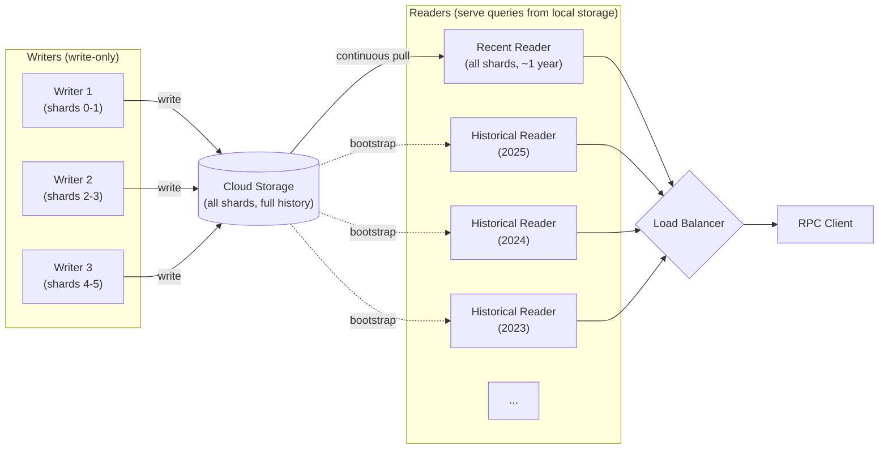

# Archival Designs: Split vs Cloud

## Current Design: Split Archival

```mermaid
graph TB
    subgraph "Split Archival Node"
        Node["Archival Node<br/>(tracks ALL shards, FULL history)"]
    end

    subgraph "Storage"
        Hot["Hot Storage<br/>(recent history)"]
        Cold["Cold Storage<br/>(old history)"]
    end

    Node -->|"recent blocks"| Hot
    Node -->|"old blocks"| Cold

    Client["RPC Client"] -->|"query"| Node
    Node -->|"read recent"| Hot
    Node -->|"read old"| Cold
```

## New Design: Cloud Archival

```mermaid
graph LR
    subgraph "Writers (write-only)"
        W1["Writer 1<br/>(shards 0-1)"]
        W2["Writer 2<br/>(shards 2-3)"]
        W3["Writer 3<br/>(shards 4-5)"]
    end

    W1 -->|"write"| Cloud
    W2 -->|"write"| Cloud
    W3 -->|"write"| Cloud

    Cloud[("Cloud Storage<br/>(all shards, full history)")]

    Cloud -->|"continuous pull"| R0
    Cloud -.->|"bootstrap"| R1
    Cloud -.->|"bootstrap"| R2
    Cloud -.->|"bootstrap"| R3

    subgraph "Readers (serve queries from local storage)"
        R0["Recent Reader<br/>(all shards, ~1 year)"]
        R1["Historical Reader<br/>(2025)"]
        R2["Historical Reader<br/>(2024)"]
        R3["Historical Reader<br/>(2023)"]
        Rn["..."]
    end

    R0 --> LB
    R1 --> LB
    R2 --> LB
    R3 --> LB

    LB{"Load Balancer"} --> Client["RPC Client"]
```
