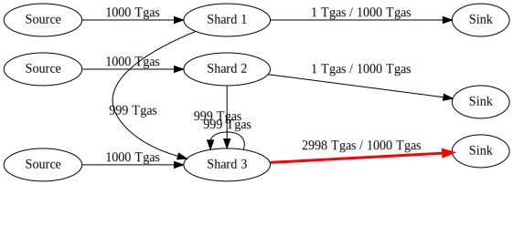
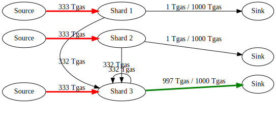

# Receipt Congestion

Near Protocol executes transactions in multiple steps, or receipts. Once a
transaction is accepted, the system has committed to finish all those receipts
even if it does not know ahead of time how many receipts there will be or on
which shards they will execute.

This naturally leads to the problem that if shards just keep accepting more
transactions, we might accept workload at a higher rate than we can execute.

## Cross-shard congestion as flow problem

For a quick formalized discussion on congestion, let us model the Near Protocol
transaction execution as a [flow
network](https://en.wikipedia.org/wiki/Flow_network).

Each shard has a source that accepts new transactions and a sink for burning
receipts. The flow is measured in gas. Edges to sinks have a capacity of 1000
Tgas. (Technically, it should be 1300 but let's keep it simple for this
discussion.)

The edges between shards are not limited in this model. In reality, we are
eventually limited by the receipt sizes and what we can send within a block time
through the network links. But if we only look at that limit, we can send very
many receipts with a lot of gas attached to them. Thus, the model considers it
unlimited.

Okay, we have the capacities of the network modeled. Now let's look how a
receipt execution maps onto it.

Let's say a receipt starts at shard 1 with 300 Tgas. While executing, it burns 100 Tgas and
creates an outgoing receipts with 200 Tgas to another shard. We can represent this in the flow network with 
100 Tgas to the sink of shard 1 and 200 Tgas to shard 2. 

Note: The graph includes the execution of the next block with the 200 Tgas to th
sink of shard 2. This should be interpreted as if we continue sending the exact
same workload on all shards every block. Then we reach this steady state where
we continue to have these gas assignments per edge.

Now we can do some flow analysis. It is immediately obvious that the total
outflow per is limited to N * 1000 Tgas but the incoming flow is unlimited.

For a finite amount of time, we can accept more inflow than outflow, we just have to add buffers to store what we cannot execute, yet. But to stay within finite memory requirements, we need to fall back to a flow diagram where outflows are greater or equal to inflows within a finite time frame.

Next, we look at a ideas one at the time before combining some of them into the
cross-shard congestion design proposed in
[NEP-539](https://github.com/near/NEPs/pull/539).

## Idea 1: Compute the minimum max-flow and stay below that limit

One approach to solve congestion would be to never allow more work into the
system than we can execute.

But this is not ideal. Just consider this example where everybody tries to access
a contract on the same shard.

In this workload where everyone want to use the capacity of the same shard, the
max-flow of the system is essentially the 1000 Tgas that shard 3 can execute. No
matter how many additional shards we add, this 1000 Tgas does not increase.

Consequently, if we want to limit inflow to be the same or lower than the
outflow, we cannot accept more than `1000 Tgas / NUM_SHARDS` of new transactions
per chunk.

So, can we just put a constant limit on sources that's `1000 Tgas / NUM_SHARDS`? Not
really, as this limit is hardly practical. It means we limit global throughput
to that of a single shard. Then why would we do sharding in the first place?

The sad thing is, there is no way around it in the most general case. A
congestion control strategy that does not apply this limit to this workload will
always have infinitely sized queues.

Of course, we won't give up. We are not limited to a constant capacity limit, we
can instead adjust it dynamically. We simply have to find a strategy that
detects such workload and eventually applies the required limit.

Most of these strategies can be gamed by malicious actors and probably that
means we eventually fall back to the minimum of `1000 Tgas / NUM_SHARDS`. But at
this stage our ambition isn't to have 100% utilization under all malicious
cases. We are instead trying to find a solution that can give 100% utilization
for normal operation and then falls back to `1000 Tgas / NUM_SHARDS` when it has
to, in order to prevent out-of-memory crashes.

## Idea 2: Limit transactions when we use too much memory

What if we have no limit at the source until we notice we are above the memory
threshold we are comfortable with? Then we can reduce the source capacity in
steps, potentially down to 0, until buffers are getting emptier and we use less
memory again.

If we do that, we can decide between either applying a global limit on all
sources (allow only `1000 Tgas / NUM_SHARDS` new transactions on all shards like
in idea 1) or applying the limit only to transactions that go to the shard with
the congestion problem.

The first choice is certainly safe. But it means that a single congested shard
leads to all shards slowing down, even if they could keep working faster without
ever sending receipts to the congested shard. This is a hit to utilization we
want to avoid. So let's try the second way.

In that case we filter transactions by receiver and keep accepting transactions
that go to non-congested shards. This would work fine, if all transactions would
only have depth 1.

But receipts produced by an accepted transaction can produce more receipts to
any other shard. Therefore, we might end up accepting more inflow that
indirectly requires bandwidth on the congested shard.

Crucially, when accepting a transaction, we don't know ahead of time which
shards will be affected by the full directed graph of receipts in a transaction.
We only know the first step. For multi-hop transactions, there is no easy way out.

But it is worth mentioning, that in practice the single-hop function call is the
most common case. And this case can be handled nicely by rejecting incoming
transactions to congested shards.

## Idea 3: Apply backpressure to stop all flows to a congested shard

On top of stopping transactions to congested shards, we can also stop receipts if they have a congested shard as the receiver.
We simply put them in a buffer of the sending shard and keep them there until
the congested shard has space again for the receipts.

The problem with this idea is that it leads to deadlocks where all receipts in
the system are waiting in outgoing buffers but cannot make progress because the
receiving shard already has too high memory usage.

## Idea 4: Keep minimum incoming queue length to avoid deadlocks

This is the final idea we need. To avoid deadlocks, we ensure that we can always
send receipts to a shard that has not enough work in the delayed receipts queue
already.

Basically, the backpressure limits from idea 3 are only applied to incoming
receipts but not for the total size. This guarantees that in the congested
scenario that previously caused a deadlock, we always have something in the
incoming queue to work on, otherwise there wouldn't be backpressure at all.

We decided to measure the incoming congestion level using gas rather than
bytes, because it is here to maximize utilization, not to minimize memory
consumption. And utilization is best measured in gas. If we have a queue of
10_000 Tgas waiting, even if only 10% of that is burnt in this step of the
transaction, we still have 1000 Tgas of useful work we can contribute to the
total flow. Thus under the assumption that at least 10% of gas is being burnt, 
we have 100% utilization.

A limit in bytes would be better to argue how much memory we need exactly. But
in some sense, the two are equivalent, as producing large receipts should cost a
linear amount of gas. What exactly the conversion rate is, is rather complicated
and warrants its own investigation with potential protocol changes to lower the
ratio in the most extreme cases. And this is important regardless of how
congestion is handled, given that network bandwidth is becoming more and more
important as we add more shards. Issue
[#8214](https://github.com/near/nearcore/issues/8214) tracks our effort on
estimating what that cost should be and
[#9378](https://github.com/near/nearcore/issues/9378) tracks our best progress
on calculating what it is today.

Of course, we can increase the queue to have even better utility guarantees. But
it comes at the cost of longer delays for every transaction or receipt that goes
through a congested shard.

This strategy also preserves the backpressure property in the sense that all
shards on a path from sources to sinks that contribute to congestion will
eventually end up with full buffers. Combined with idea 2, eventually all
transactions to those shards are rejected. All of this without affecting shards
that are not on the critical path.

## Putting it all together

The proposal in [NEP-539](https://github.com/near/NEPs/pull/539) combines all
ideas 2, 3, and 4.

We have a limit of how much memory we consider to be normal operations (for
example 500 MB). Then we stop new transaction coming in to that shard but still
allow more incoming transactions to other shards if those are not congested.
That alone already solves all problems with single-hop transactions.

In the congested shard itself, we also keep accepting transactions to other
shards. But we heavily reduce the gas allocated for new transactions, in order
to have more capacity to work on finishing the waiting receipts. This is
technically not necessary for any specific property, but it should make sense
intuitively that this helps to reduce congestion quicker and therefore lead to a
better user experience. This is why we added this feature. And our simulations
also support this intuition.

Then we apply backpressure for multi-hop receipts and avoid deadlocks by only
applying the backpressure when we still have enough work queued up that holding
it back cannot lead to a slowed down global throughput.

Another design decision was to linearly interpolate the limits, as opposed to
binary on and off states. This way, we don't have to be too precise in finding
the right parameters, as the system should balance itself around a specific
limit that works for each workload.