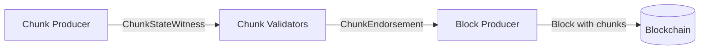
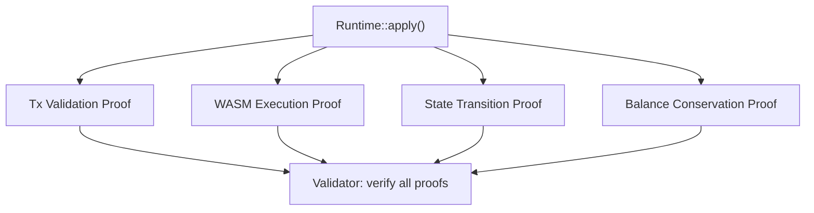

# NEAR Transaction Execution ZK Analysis

## Purpose

This document maps every operation performed by **chunk producers** during transaction execution, identifies which of those operations are **repeated by validators**, and assesses how amenable each operation is to being replaced or augmented with **succinct (ZK) proofs** of execution. The goal is to understand where ZK proofs could reduce validator work from full re-execution to proof verification.

---

## 1. Architecture Overview

NEAR is a sharded blockchain. Each shard has its own state and processes a subset of transactions and receipts. The key roles:

- **Chunk Producers**: Selected per shard per block height. They execute transactions and receipts, produce a chunk containing the results, and generate a [`ChunkStateWitness`](https://github.com/near/nearcore/blob/2eba640aeb7663faf4d638aa5ac5214200e9fc09/core/primitives/src/stateless_validation/state_witness.rs#L97) proving the state transition.
- **Chunk Validators**: Verify the chunk by re-executing the state transition using the [`ChunkStateWitness`](https://github.com/near/nearcore/blob/2eba640aeb7663faf4d638aa5ac5214200e9fc09/core/primitives/src/stateless_validation/state_witness.rs#L97) (stateless validation). If valid, they send a [`ChunkEndorsement`](https://github.com/near/nearcore/blob/2eba640aeb7663faf4d638aa5ac5214200e9fc09/core/primitives/src/stateless_validation/chunk_endorsement.rs#L19).
- **Block Producers**: Collect endorsed chunks and include them in blocks.

### Current Stateless Validation Model

<div align="center">



</div>

Today, validators perform **full re-execution** of all transactions and receipts. They don't need the full shard state because they receive a partial state (trie nodes) in the witness, but they do repeat all computation. This is what we want to optimize with ZK proofs.

### SPICE: Separation of Consensus and Execution

[SPICE](https://docs.google.com/document/d/1gJsRQig3F1M-3g_YilmEWJFpaHiNGHGlULE3mVNSbKo) decouples consensus from execution by introducing two chains:
- **Consensus Chain**: Contains only transactions, runs Doomslug consensus. No state roots or chunk endorsements in blocks.
- **Shadow Chain**: A local data structure derived from the consensus chain, representing state transitions. Most blockchain logic (trie, flat storage, ChunkExtra, etc.) operates here.

Chunk producers execute asynchronously, produce state witnesses and collect chunk endorsements, then submit **State Proposals** (chunk results + endorsements) to the consensus chain. The consensus block time is elastic — it slows down if the shadow chain falls behind.

Crucially, `Runtime::apply()`, stateless validation, and the state witness mechanism **remain the same** under SPICE. The ZK analysis in this document applies to both the current model and SPICE. SPICE does, however, change the timing constraints — see the notes in sections 4 and 6.

---

## 2. The Transaction Execution Pipeline

### 2.1 Entry Point: [`Runtime::apply()`](https://github.com/near/nearcore/blob/2eba640aeb7663faf4d638aa5ac5214200e9fc09/runtime/runtime/src/lib.rs#L1359)

**File**: [`runtime/runtime/src/lib.rs`](https://github.com/near/nearcore/blob/2eba640aeb7663faf4d638aa5ac5214200e9fc09/runtime/runtime/src/lib.rs)

This is the central function for both chunk producers and validators. It takes:
- [`ApplyState`](https://github.com/near/nearcore/blob/2eba640aeb7663faf4d638aa5ac5214200e9fc09/runtime/runtime/src/lib.rs#L158): block context (height, timestamp, gas price, gas limit, etc.)
- `prev_state_root`: the [Merkle-Patricia trie](https://ethereum.org/developers/docs/data-structures-and-encoding/patricia-merkle-trie/) (MPT) root before execution
- A list of incoming `Receipt`s and `SignedTransaction`s

It returns an [`ApplyResult`](https://github.com/near/nearcore/blob/2eba640aeb7663faf4d638aa5ac5214200e9fc09/runtime/runtime/src/lib.rs#L241) containing:
- New state root
- Execution outcomes for each transaction/receipt
- Outgoing receipts
- Validator proposals
- State changes
- Statistics

### 2.2 Execution Phases (in order)

The [`apply()`](https://github.com/near/nearcore/blob/2eba640aeb7663faf4d638aa5ac5214200e9fc09/runtime/runtime/src/lib.rs#L1359) method processes work in this order:

| Phase | Description | Key Function |
|-------|-------------|-------------|
| **1. Process incoming transactions** | Validate and convert transactions to receipts | [`process_transactions()`](https://github.com/near/nearcore/blob/2eba640aeb7663faf4d638aa5ac5214200e9fc09/runtime/runtime/src/lib.rs#L1524) |
| **2. Process incoming receipts** | Execute action/data receipts from other shards/previous blocks | [`process_receipt()`](https://github.com/near/nearcore/blob/2eba640aeb7663faf4d638aa5ac5214200e9fc09/runtime/runtime/src/lib.rs#L988) |
| **3. Process delayed receipts** | Execute receipts that were delayed due to gas limits | [`process_receipt()`](https://github.com/near/nearcore/blob/2eba640aeb7663faf4d638aa5ac5214200e9fc09/runtime/runtime/src/lib.rs#L988) |
| **4. Validate & apply state** | Verify balance, finalize state | [`validate_apply_state_update()`](https://github.com/near/nearcore/blob/2eba640aeb7663faf4d638aa5ac5214200e9fc09/runtime/runtime/src/lib.rs#L2292) |
| **5. Compute state root** | Finalize trie updates, compute new Merkle root | [`trie_update.finalize()`](https://github.com/near/nearcore/blob/2eba640aeb7663faf4d638aa5ac5214200e9fc09/core/store/src/trie/update.rs#L247) |
| **6. Compute outcomes** | Hash execution outcomes for inclusion in chunk | [`merklize()`](https://github.com/near/nearcore/blob/2eba640aeb7663faf4d638aa5ac5214200e9fc09/core/primitives/src/merkle.rs#L47) |

---

## 3. Detailed Operation Mapping

### 3.1 Transaction Processing

**Files**: [`runtime/runtime/src/lib.rs`](https://github.com/near/nearcore/blob/2eba640aeb7663faf4d638aa5ac5214200e9fc09/runtime/runtime/src/lib.rs) ([`process_transactions()`](https://github.com/near/nearcore/blob/2eba640aeb7663faf4d638aa5ac5214200e9fc09/runtime/runtime/src/lib.rs#L1524)) and [`runtime/runtime/src/verifier.rs`](https://github.com/near/nearcore/blob/2eba640aeb7663faf4d638aa5ac5214200e9fc09/runtime/runtime/src/verifier.rs) ([`validate_transaction()`](https://github.com/near/nearcore/blob/2eba640aeb7663faf4d638aa5ac5214200e9fc09/runtime/runtime/src/verifier.rs#L116))

#### Operations performed:

| # | Operation | Description | Chunk Producer | Validator | ZK Difficulty |
|---|-----------|-------------|:-:|:-:|:---:|
| 1 | **Signature verification** | Verify ed25519/secp256k1 signature on the transaction | YES | YES | MEDIUM |
| 2 | **Account lookup** | Read signer account from trie state | YES | YES | MEDIUM |
| 3 | **Access key lookup** | Read access key from trie state | YES | YES | MEDIUM |
| 4 | **Nonce validation** | Check tx nonce > access key nonce | YES | YES | EASY |
| 5 | **Block hash validation** | Verify tx `block_hash` is recent (within validity period) | YES | YES | EASY |
| 6 | **Balance check** | Verify signer has enough balance for attached deposit + gas | YES | YES | EASY |
| 7 | **Actions validation** | Validate each action (sizes, limits, well-formedness) | YES | YES | EASY |
| 8 | **Gas price computation** | Compute required gas cost at current gas price | YES | YES | EASY |
| 9 | **Nonce update** | Write new nonce to access key in state | YES | YES | MEDIUM |
| 10 | **Balance deduction** | Deduct gas prepayment from signer balance | YES | YES | EASY |
| 11 | **Receipt creation** | Convert transaction into an ActionReceipt | YES | YES | EASY |

#### Signature Verification Details:
- NEAR supports **ed25519** and **secp256k1** signatures
- This is the most crypto-heavy part of transaction processing

### 3.2 Receipt Processing

**File**: [`runtime/runtime/src/lib.rs`](https://github.com/near/nearcore/blob/2eba640aeb7663faf4d638aa5ac5214200e9fc09/runtime/runtime/src/lib.rs) ([`process_receipt()`](https://github.com/near/nearcore/blob/2eba640aeb7663faf4d638aa5ac5214200e9fc09/runtime/runtime/src/lib.rs#L988), [`apply_action_receipt()`](https://github.com/near/nearcore/blob/2eba640aeb7663faf4d638aa5ac5214200e9fc09/runtime/runtime/src/lib.rs#L584))

Receipts are the primary unit of execution. There are two types:

#### 3.2.1 Data Receipts
Simple: just store the data in state for a dependent action receipt.

| # | Operation | ZK Difficulty |
|---|-----------|:---:|
| 1 | Store received data in trie | MEDIUM |
| 2 | Check if all data dependencies for pending receipts are met | EASY |

#### 3.2.2 Action Receipts
This is where the bulk of execution happens. For each action in the receipt:

| # | Operation | Description | Both Execute | ZK Difficulty |
|---|-----------|-------------|:-:|:---:|
| 1 | **Account lookup** | Read receiver account from trie | YES | MEDIUM |
| 2 | **Promise results collection** | Gather results of dependent promises | YES | EASY |
| 3 | **Apply each action** | See action table below | YES | VARIES |
| 4 | **Gas refund computation** | Calculate unused gas refund | YES | EASY |
| 5 | **Refund receipt creation** | Create receipt to refund unused gas/tokens | YES | EASY |
| 6 | **Execution outcome creation** | Build outcome with logs, gas used, etc. | YES | EASY |
| 7 | **Outcome hashing** | Hash the execution outcome (SHA-256) | YES | EASY |

### 3.3 Individual Actions

**File**: [`runtime/runtime/src/actions.rs`](https://github.com/near/nearcore/blob/2eba640aeb7663faf4d638aa5ac5214200e9fc09/runtime/runtime/src/actions.rs)

| Action | Key Operations | ZK Difficulty | Notes |
|--------|---------------|:---:|-------|
| **CreateAccount** ([`action_create_account()`](https://github.com/near/nearcore/blob/2eba640aeb7663faf4d638aa5ac5214200e9fc09/runtime/runtime/src/actions.rs#L452)) | Write new account record to trie | MEDIUM | Simple state write |
| **DeployContract** ([`action_deploy_contract()`](https://github.com/near/nearcore/blob/2eba640aeb7663faf4d638aa5ac5214200e9fc09/runtime/runtime/src/actions.rs#L575)) | Write WASM code to trie, compute code hash | MEDIUM | Large data write, SHA-256 hash |
| **FunctionCall** ([`action_function_call()`](https://github.com/near/nearcore/blob/2eba640aeb7663faf4d638aa5ac5214200e9fc09/runtime/runtime/src/actions.rs#L150)) | WASM execution (see [3.4](#34-wasm-smart-contract-execution-functioncall)), state reads/writes | **HARD** | Dominates execution cost |
| **Transfer** ([`action_transfer()`](https://github.com/near/nearcore/blob/2eba640aeb7663faf4d638aa5ac5214200e9fc09/runtime/runtime/src/actions.rs#L445)) | Update sender/receiver balances in trie | MEDIUM | Arithmetic + state write |
| **Stake** ([`action_stake()`](https://github.com/near/nearcore/blob/2eba640aeb7663faf4d638aa5ac5214200e9fc09/runtime/runtime/src/actions.rs#L365)) | Update staking amount, create validator proposal | MEDIUM | State write + epoch logic |
| **AddKey** ([`action_add_key()`](https://github.com/near/nearcore/blob/2eba640aeb7663faf4d638aa5ac5214200e9fc09/runtime/runtime/src/actions.rs#L748)) | Write access key to trie | MEDIUM | State write |
| **DeleteKey** ([`action_delete_key()`](https://github.com/near/nearcore/blob/2eba640aeb7663faf4d638aa5ac5214200e9fc09/runtime/runtime/src/actions.rs#L721)) | Remove access key from trie | MEDIUM | State write |
| **DeleteAccount** ([`action_delete_account()`](https://github.com/near/nearcore/blob/2eba640aeb7663faf4d638aa5ac5214200e9fc09/runtime/runtime/src/actions.rs#L619)) | Remove all account data from trie, transfer balance | MEDIUM | Multiple state deletes |

> **Note**: For simplicity, delegate actions (meta-transactions) and global contract actions (DeployGlobalContract, UseGlobalContract) are not covered in this analysis.

### 3.4 WASM Smart Contract Execution (FunctionCall)

**File**: [`runtime/near-vm-runner/src/`](https://github.com/near/nearcore/blob/2eba640aeb7663faf4d638aa5ac5214200e9fc09/runtime/near-vm-runner/src/) (entry: [`runner::run()`](https://github.com/near/nearcore/blob/2eba640aeb7663faf4d638aa5ac5214200e9fc09/runtime/near-vm-runner/src/runner.rs#L89))

This is the most complex and computationally expensive operation. Both chunk producers and validators execute identical WASM code.

#### 3.4.1 Pre-execution Pipeline

| # | Operation | ZK Difficulty | Notes |
|---|-----------|:---:|-------|
| 1 | **Contract code lookup** | MEDIUM | Read WASM bytes from trie (or cache) |
| 2 | **WASM preparation/instrumentation** | **HARD** | Gas metering injection, safety checks ([`prepare.rs`](https://github.com/near/nearcore/blob/2eba640aeb7663faf4d638aa5ac5214200e9fc09/runtime/near-vm-runner/src/prepare.rs#L22)) |
| 3 | **WASM compilation** | **HARD** | Compile WASM to native (Wasmer 2.0 / near-vm) |
| 4 | **Instantiation** | HARD | Create VM instance with imports |

Note: Steps 2-3 are cached in production. The cache itself is deterministic.

#### 3.4.2 Host Functions (Blockchain API exposed to WASM)

Smart contracts interact with the blockchain through ~80+ host functions defined in [`VMLogic`](https://github.com/near/nearcore/blob/2eba640aeb7663faf4d638aa5ac5214200e9fc09/runtime/near-vm-runner/src/logic/logic.rs#L148). These are the operations contracts can perform:

**Context/Read-only functions** (EASY to prove):
- [`current_account_id()`](https://github.com/near/nearcore/blob/2eba640aeb7663faf4d638aa5ac5214200e9fc09/runtime/near-vm-runner/src/logic/logic.rs#L632), [`signer_account_id()`](https://github.com/near/nearcore/blob/2eba640aeb7663faf4d638aa5ac5214200e9fc09/runtime/near-vm-runner/src/logic/logic.rs#L655), [`predecessor_account_id()`](https://github.com/near/nearcore/blob/2eba640aeb7663faf4d638aa5ac5214200e9fc09/runtime/near-vm-runner/src/logic/logic.rs#L713)
- [`input()`](https://github.com/near/nearcore/blob/2eba640aeb7663faf4d638aa5ac5214200e9fc09/runtime/near-vm-runner/src/logic/logic.rs#L767) (read function call arguments)
- [`block_index()`](https://github.com/near/nearcore/blob/2eba640aeb7663faf4d638aa5ac5214200e9fc09/runtime/near-vm-runner/src/logic/logic.rs#L788), [`block_timestamp()`](https://github.com/near/nearcore/blob/2eba640aeb7663faf4d638aa5ac5214200e9fc09/runtime/near-vm-runner/src/logic/logic.rs#L798), [`epoch_height()`](https://github.com/near/nearcore/blob/2eba640aeb7663faf4d638aa5ac5214200e9fc09/runtime/near-vm-runner/src/logic/logic.rs#L808)
- [`account_balance()`](https://github.com/near/nearcore/blob/2eba640aeb7663faf4d638aa5ac5214200e9fc09/runtime/near-vm-runner/src/logic/logic.rs#L875), [`account_locked_balance()`](https://github.com/near/nearcore/blob/2eba640aeb7663faf4d638aa5ac5214200e9fc09/runtime/near-vm-runner/src/logic/logic.rs#L889), [`attached_deposit()`](https://github.com/near/nearcore/blob/2eba640aeb7663faf4d638aa5ac5214200e9fc09/runtime/near-vm-runner/src/logic/logic.rs#L908)
- [`prepaid_gas()`](https://github.com/near/nearcore/blob/2eba640aeb7663faf4d638aa5ac5214200e9fc09/runtime/near-vm-runner/src/logic/logic.rs#L927), [`used_gas()`](https://github.com/near/nearcore/blob/2eba640aeb7663faf4d638aa5ac5214200e9fc09/runtime/near-vm-runner/src/logic/logic.rs#L946)
- [`storage_usage()`](https://github.com/near/nearcore/blob/2eba640aeb7663faf4d638aa5ac5214200e9fc09/runtime/near-vm-runner/src/logic/logic.rs#L860)

**Storage functions** (MEDIUM - requires trie proof):
- [`storage_read(key)`](https://github.com/near/nearcore/blob/2eba640aeb7663faf4d638aa5ac5214200e9fc09/runtime/near-vm-runner/src/logic/logic.rs#L3680) → read value from account's trie storage
- [`storage_write(key, value)`](https://github.com/near/nearcore/blob/2eba640aeb7663faf4d638aa5ac5214200e9fc09/runtime/near-vm-runner/src/logic/logic.rs#L3589) → write value to account's trie storage
- [`storage_remove(key)`](https://github.com/near/nearcore/blob/2eba640aeb7663faf4d638aa5ac5214200e9fc09/runtime/near-vm-runner/src/logic/logic.rs#L3743) → delete key from trie storage
- [`storage_has_key(key)`](https://github.com/near/nearcore/blob/2eba640aeb7663faf4d638aa5ac5214200e9fc09/runtime/near-vm-runner/src/logic/logic.rs#L3799) → check existence in trie

**Cryptographic functions** (MEDIUM to HARD):
- [`sha256(data)`](https://github.com/near/nearcore/blob/2eba640aeb7663faf4d638aa5ac5214200e9fc09/runtime/near-vm-runner/src/logic/logic.rs#L1532) → SHA-256 hash
- [`keccak256(data)`](https://github.com/near/nearcore/blob/2eba640aeb7663faf4d638aa5ac5214200e9fc09/runtime/near-vm-runner/src/logic/logic.rs#L1558) → Keccak-256 hash
- [`keccak512(data)`](https://github.com/near/nearcore/blob/2eba640aeb7663faf4d638aa5ac5214200e9fc09/runtime/near-vm-runner/src/logic/logic.rs#L1584) → Keccak-512 hash
- [`ripemd160(data)`](https://github.com/near/nearcore/blob/2eba640aeb7663faf4d638aa5ac5214200e9fc09/runtime/near-vm-runner/src/logic/logic.rs#L1612) → RIPEMD-160 hash
- [`ed25519_verify(sig, msg, pubkey)`](https://github.com/near/nearcore/blob/2eba640aeb7663faf4d638aa5ac5214200e9fc09/runtime/near-vm-runner/src/logic/logic.rs#L1758) → Ed25519 signature verification
- [`ecrecover(hash, sig, v, malleability_flag)`](https://github.com/near/nearcore/blob/2eba640aeb7663faf4d638aa5ac5214200e9fc09/runtime/near-vm-runner/src/logic/logic.rs#L1656) → secp256k1 recovery
- [`alt_bn128_g1_multiexp()`](https://github.com/near/nearcore/blob/2eba640aeb7663faf4d638aa5ac5214200e9fc09/runtime/near-vm-runner/src/logic/logic.rs#L987), [`alt_bn128_g1_sum()`](https://github.com/near/nearcore/blob/2eba640aeb7663faf4d638aa5ac5214200e9fc09/runtime/near-vm-runner/src/logic/logic.rs#L1037), [`alt_bn128_pairing_check()`](https://github.com/near/nearcore/blob/2eba640aeb7663faf4d638aa5ac5214200e9fc09/runtime/near-vm-runner/src/logic/logic.rs#L1086) → BN254 curve ops
- [`bls12381_*`](https://github.com/near/nearcore/blob/2eba640aeb7663faf4d638aa5ac5214200e9fc09/runtime/near-vm-runner/src/logic/logic.rs#L1396) → BLS12-381 curve operations (pairing, multiexp, etc.)

**Promise/Receipt creation functions** (EASY - deterministic logic):
- [`promise_create()`](https://github.com/near/nearcore/blob/2eba640aeb7663faf4d638aa5ac5214200e9fc09/runtime/near-vm-runner/src/logic/logic.rs#L1906), [`promise_then()`](https://github.com/near/nearcore/blob/2eba640aeb7663faf4d638aa5ac5214200e9fc09/runtime/near-vm-runner/src/logic/logic.rs#L1949), [`promise_and()`](https://github.com/near/nearcore/blob/2eba640aeb7663faf4d638aa5ac5214200e9fc09/runtime/near-vm-runner/src/logic/logic.rs#L2000)
- [`promise_batch_create()`](https://github.com/near/nearcore/blob/2eba640aeb7663faf4d638aa5ac5214200e9fc09/runtime/near-vm-runner/src/logic/logic.rs#L2074), [`promise_batch_then()`](https://github.com/near/nearcore/blob/2eba640aeb7663faf4d638aa5ac5214200e9fc09/runtime/near-vm-runner/src/logic/logic.rs#L2115)
- [`promise_batch_action_*()`](https://github.com/near/nearcore/blob/2eba640aeb7663faf4d638aa5ac5214200e9fc09/runtime/near-vm-runner/src/logic/logic.rs#L2226) (create_account, deploy_contract, function_call, transfer, stake, add_key, delete_key, delete_account, etc.)
- [`promise_results_count()`](https://github.com/near/nearcore/blob/2eba640aeb7663faf4d638aa5ac5214200e9fc09/runtime/near-vm-runner/src/logic/logic.rs#L3212), [`promise_result()`](https://github.com/near/nearcore/blob/2eba640aeb7663faf4d638aa5ac5214200e9fc09/runtime/near-vm-runner/src/logic/logic.rs#L3245)
- [`promise_return()`](https://github.com/near/nearcore/blob/2eba640aeb7663faf4d638aa5ac5214200e9fc09/runtime/near-vm-runner/src/logic/logic.rs#L3285)

**Output functions** (EASY):
- [`value_return(data)`](https://github.com/near/nearcore/blob/2eba640aeb7663faf4d638aa5ac5214200e9fc09/runtime/near-vm-runner/src/logic/logic.rs#L3321) → set return value
- [`log_utf8()`](https://github.com/near/nearcore/blob/2eba640aeb7663faf4d638aa5ac5214200e9fc09/runtime/near-vm-runner/src/logic/logic.rs#L3406), [`log_utf16()`](https://github.com/near/nearcore/blob/2eba640aeb7663faf4d638aa5ac5214200e9fc09/runtime/near-vm-runner/src/logic/logic.rs#L3430) → emit logs
- [`panic()`](https://github.com/near/nearcore/blob/2eba640aeb7663faf4d638aa5ac5214200e9fc09/runtime/near-vm-runner/src/logic/logic.rs#L3370), [`panic_utf8()`](https://github.com/near/nearcore/blob/2eba640aeb7663faf4d638aa5ac5214200e9fc09/runtime/near-vm-runner/src/logic/logic.rs#L3386) → abort execution

**Register functions** (EASY - memory management):
- [`read_register()`](https://github.com/near/nearcore/blob/2eba640aeb7663faf4d638aa5ac5214200e9fc09/runtime/near-vm-runner/src/logic/logic.rs#L418), [`register_len()`](https://github.com/near/nearcore/blob/2eba640aeb7663faf4d638aa5ac5214200e9fc09/runtime/near-vm-runner/src/logic/logic.rs#L435), [`write_register()`](https://github.com/near/nearcore/blob/2eba640aeb7663faf4d638aa5ac5214200e9fc09/runtime/near-vm-runner/src/logic/logic.rs#L453)

**Math functions** (EASY):
- [`random_seed()`](https://github.com/near/nearcore/blob/2eba640aeb7663faf4d638aa5ac5214200e9fc09/runtime/near-vm-runner/src/logic/logic.rs#L1512) → deterministic random based on block VRF
- [`validator_stake()`](https://github.com/near/nearcore/blob/2eba640aeb7663faf4d638aa5ac5214200e9fc09/runtime/near-vm-runner/src/logic/logic.rs#L819), [`validator_total_stake()`](https://github.com/near/nearcore/blob/2eba640aeb7663faf4d638aa5ac5214200e9fc09/runtime/near-vm-runner/src/logic/logic.rs#L839)

#### 3.4.3 Gas Metering

Every WASM instruction and host function call is metered:
- WASM instructions: instrumented during preparation, [`finite_wasm_gas()`](https://github.com/near/nearcore/blob/2eba640aeb7663faf4d638aa5ac5214200e9fc09/runtime/near-vm-runner/src/logic/logic.rs#L288) called per basic block
- Host functions: each charges base cost + per-byte cost
- Gas counter tracks [`burnt_gas`](https://github.com/near/nearcore/blob/2eba640aeb7663faf4d638aa5ac5214200e9fc09/runtime/near-vm-runner/src/logic/gas_counter.rs#L36) (consumed) and [`used_gas`](https://github.com/near/nearcore/blob/2eba640aeb7663faf4d638aa5ac5214200e9fc09/runtime/near-vm-runner/src/logic/gas_counter.rs#L344) (including prepaid for sub-calls)

Gas metering is **deterministic** and must produce identical results on all nodes.

### 3.5 State Trie Operations

**File**: [`core/store/src/trie/`](https://github.com/near/nearcore/blob/2eba640aeb7663faf4d638aa5ac5214200e9fc09/core/store/src/trie/) (main struct: [`Trie`](https://github.com/near/nearcore/blob/2eba640aeb7663faf4d638aa5ac5214200e9fc09/core/store/src/trie/mod.rs#L245))

The state is stored in a **Merkle-Patricia Trie**. Every state read/write during execution involves:

| Operation | What Happens | ZK Difficulty |
|-----------|-------------|:---:|
| **Trie lookup** | Traverse trie nodes from root to leaf, following key nibbles through Extension/Branch/Leaf nodes | MEDIUM |
| **Trie insert** | Create/modify leaf node, potentially restructure branch/extension nodes, recompute hashes up to root | MEDIUM-HARD |
| **Trie delete** | Remove node, potentially merge extension nodes, recompute hashes up to root | MEDIUM-HARD |
| **State root computation** | After all operations, compute new root hash by hashing all modified nodes bottom-up | MEDIUM |

#### Trie Hashing:
- Each trie node is Borsh-serialized and hashed with SHA-256 ([`CryptoHash::hash_bytes()`](https://github.com/near/nearcore/blob/2eba640aeb7663faf4d638aa5ac5214200e9fc09/core/primitives-core/src/hash.rs#L36))
- Node types: `Leaf(key, value_ref)`, `Extension(key, child_hash)`, `Branch([16 child_hashes], optional_value_ref)` — see [`RawTrieNode`](https://github.com/near/nearcore/blob/2eba640aeb7663faf4d638aa5ac5214200e9fc09/core/store/src/trie/raw_node.rs#L28)
- [`RawTrieNodeWithSize`](https://github.com/near/nearcore/blob/2eba640aeb7663faf4d638aa5ac5214200e9fc09/core/store/src/trie/raw_node.rs#L12) `{ node, memory_usage }` is the unit that gets hashed via [`hash()`](https://github.com/near/nearcore/blob/2eba640aeb7663faf4d638aa5ac5214200e9fc09/core/store/src/trie/raw_node.rs#L18)
- The state root is the hash of the root node

#### ZK Implications of SHA-256 Hashing:
- SHA-256 operates at the bit level, which is expensive in ZK circuits (~[30K constraints per hash](https://eprint.iacr.org/2023/681.pdf)). ZK-native hash functions like [Poseidon](https://eprint.iacr.org/2019/458.pdf) are orders of magnitude cheaper but would require a protocol-level trie hash migration.
- Ethereum is moving to [Verkle trees](https://ethereum.org/roadmap/verkle-trees/) partly for this reason, though [whether Verkle trees are actually more ZK-friendly than MPTs depends on implementation details](https://hackmd.io/@dlubarov/B1rVbPgb0).
- [Kairos Trie](https://medium.com/casperblockchain/kairos-efficient-merkle-trie-for-zk-vms-718e957a07e9) is an effort to build an MPT specifically optimized for ZK VMs.

#### Trie Recording (for witness generation):
- During chunk production, the trie operates in **recording mode** ([`TrieRecorder`](https://github.com/near/nearcore/blob/2eba640aeb7663faf4d638aa5ac5214200e9fc09/core/store/src/trie/trie_recording.rs#L16))
- Every trie node accessed during execution is recorded
- These recorded nodes form the [`PartialState`](https://github.com/near/nearcore/blob/2eba640aeb7663faf4d638aa5ac5214200e9fc09/core/primitives/src/state.rs#L15) included in the [`ChunkStateWitness`](https://github.com/near/nearcore/blob/2eba640aeb7663faf4d638aa5ac5214200e9fc09/core/primitives/src/stateless_validation/state_witness.rs#L97)
- Validators reconstruct a partial trie from these nodes and re-execute against it

### 3.6 Balance Checking

Handled as part of [`validate_apply_state_update()`](https://github.com/near/nearcore/blob/2eba640aeb7663faf4d638aa5ac5214200e9fc09/runtime/runtime/src/lib.rs#L2292) in `runtime/runtime/src/lib.rs`.

After all transactions and receipts are processed:

| # | Check | ZK Difficulty |
|---|-------|:---:|
| 1 | Sum of all incoming balances (accounts + receipts + rewards) | EASY |
| 2 | Sum of all outgoing balances (accounts + outgoing receipts + burnt gas + slashed) | EASY |
| 3 | Verify incoming == outgoing (token conservation) | EASY |

---

## 4. What Validators Do Today (Stateless Validation)

### 4.1 The ChunkStateWitness

**File**: [`core/primitives/src/stateless_validation/state_witness.rs`](https://github.com/near/nearcore/blob/2eba640aeb7663faf4d638aa5ac5214200e9fc09/core/primitives/src/stateless_validation/state_witness.rs)

Structure ([`ChunkStateWitnessV2`](https://github.com/near/nearcore/blob/2eba640aeb7663faf4d638aa5ac5214200e9fc09/core/primitives/src/stateless_validation/state_witness.rs#L105)):
```
ChunkStateWitnessV2 {
    epoch_id: EpochId,
    chunk_header: ShardChunkHeader,
    main_state_transition: ChunkStateTransition {  // see line 293
        block_hash: CryptoHash,
        base_state: PartialState,     // Trie nodes needed for execution
        post_state_root: CryptoHash,  // Expected result
    },
    source_receipt_proofs: HashMap<ChunkHash, ReceiptProof>,
    applied_receipts_hash: CryptoHash,
    transactions: Vec<SignedTransaction>,
    implicit_transitions: Vec<ChunkStateTransition>,
    new_transactions: Vec<SignedTransaction>,
}
```

Size limits: ~64 MiB uncompressed, compressed with zstd level 1.

### 4.2 Validator Workflow

**File**: [`chain/chain/src/stateless_validation/chunk_validation.rs`](https://github.com/near/nearcore/blob/2eba640aeb7663faf4d638aa5ac5214200e9fc09/chain/chain/src/stateless_validation/chunk_validation.rs)

<div align="center">


</div>

#### Phase 1: Pre-Validation ([`pre_validate_chunk_state_witness()`](https://github.com/near/nearcore/blob/2eba640aeb7663faf4d638aa5ac5214200e9fc09/chain/chain/src/stateless_validation/chunk_validation.rs#L308))
1. Validate chunk header version compatibility
2. Determine block ranges needed for receipt proof validation
3. Verify `source_receipt_proofs` against block merkle roots
4. Validate transaction merkle root
5. Check transaction validity periods

#### Phase 2: Full Validation ([`validate_chunk_state_witness()`](https://github.com/near/nearcore/blob/2eba640aeb7663faf4d638aa5ac5214200e9fc09/chain/chain/src/stateless_validation/chunk_validation.rs#L760), on computation threads)
1. **Reconstruct partial trie** from `base_state` ([`PartialState`](https://github.com/near/nearcore/blob/2eba640aeb7663faf4d638aa5ac5214200e9fc09/core/primitives/src/state.rs#L15) nodes)
2. **Re-execute ALL transactions and receipts** using [`Runtime::apply()`](https://github.com/near/nearcore/blob/2eba640aeb7663faf4d638aa5ac5214200e9fc09/runtime/runtime/src/lib.rs#L1359)
3. **Verify computed state root** matches `post_state_root` from witness
4. **Apply implicit transitions** (validator rewards for missing chunks)
5. **Verify implicit state roots** match
6. **Verify outgoing receipts** merkle root

#### Phase 3: Endorsement
If everything matches, sign and broadcast a [`ChunkEndorsement`](https://github.com/near/nearcore/blob/2eba640aeb7663faf4d638aa5ac5214200e9fc09/core/primitives/src/stateless_validation/chunk_endorsement.rs#L19) (tracked by [`ChunkEndorsementTracker`](https://github.com/near/nearcore/blob/2eba640aeb7663faf4d638aa5ac5214200e9fc09/chain/client/src/stateless_validation/chunk_endorsement.rs#L22)).

### 4.3 Operations Validators REPEAT vs TRUST

| Operation | Validator Action | Could Skip with ZK? |
|-----------|-----------------|:---:|
| Tx signature verification | **RE-EXECUTE** | YES |
| WASM contract execution | **RE-EXECUTE** | YES |
| All state reads/writes | **RE-EXECUTE** (via partial trie) | YES |
| Gas metering | **RE-EXECUTE** | YES |
| Balance checking | **RE-EXECUTE** | YES |
| Receipt generation | **RE-EXECUTE** | YES |
| State root computation | **RE-EXECUTE** | YES |
| Receipt proof verification | **VERIFY** (against block merkle roots) | Separate from execution proof* |
| Block hash lookups | **TRUST** (from blockchain history) | N/A |
| Epoch/validator info | **TRUST** (from epoch manager) | N/A |

*\*Receipt proof verification checks that incoming receipts are authentic by verifying Merkle proofs against block headers from other shards/blocks. A ZK proof of `Runtime::apply()` would prove execution correctness given the inputs, but not the authenticity of those inputs. Receipt proof verification could remain as-is (it's already just a Merkle check, not a re-execution) or be covered by a separate ZK Merkle inclusion proof.*

**Key insight**: Validators currently re-execute 100% of the computation. The only things they "trust" are blockchain history and epoch configuration, which are already consensus-verified.

> **SPICE note**: Under SPICE, stateless validation remains the same — chunk validators still re-execute via `Runtime::apply()` and issue chunk endorsements. The difference is that endorsements are collected by the chunk producer and submitted asynchronously as part of a State Proposal, rather than being sent directly to the block producer on the consensus critical path. This means ZK proofs replacing re-execution would have the same effect under SPICE as under the current model.

---

## 5. ZK Provability Assessment

### 5.1 Difficulty Categories

| Category | Description | Examples |
|----------|-------------|---------|
| **EASY** | Simple arithmetic, comparisons, deterministic logic | Balance checks, nonce validation, gas accounting |
| **MEDIUM** | Standard crypto operations, state lookups via Merkle proofs | SHA-256 hashing, trie operations, signature verification |
| **HARD** | Complex computation, large circuit size | WASM execution, BLS12-381 pairings, WASM compilation |
| **VERY HARD** | Non-standard or extremely complex operations | Arbitrary WASM programs, floating-point operations |

### 5.2 Operation-by-Operation ZK Analysis

#### 5.2.1 Transaction Validation (MEDIUM overall)
- **Signature verification**: Well-studied in ZK. Ed25519 in ZK circuits exists (e.g., circom-eddsa) but is expensive (~millions of constraints). secp256k1 ECDSA is also available.
- **State lookups**: Merkle-Patricia trie proofs map naturally to ZK — prove a path from root to leaf. NEAR uses SHA-256 for node hashing which has efficient ZK circuits.
- **Arithmetic checks**: Trivial in ZK.

#### 5.2.2 WASM Execution (HARD - the main challenge)
This is by far the hardest part. Options:

**Option A: zkVM approach** (e.g., [RISC Zero](https://github.com/risc0/risc0), [SP1](https://github.com/succinctlabs/sp1), [Jolt](https://github.com/a16z/jolt))
- Compile WASM to RISC-V or other ISA, then prove execution in a zkVM
- Pros: General-purpose, handles any contract
- Cons: Very expensive proving time, large circuits, WASM→RISC-V translation overhead
- Current state-of-art: ~1M cycles/second proving speed
- Licenses: RISC Zero (Apache 2.0), SP1 (MIT), Jolt (MIT / Apache 2.0)

**Option B: zkWASM** (e.g., [zkWasm by DelphinusLab](https://github.com/DelphinusLab/zkWasm))
- Directly prove WASM execution
- Pros: No translation overhead
- Cons: Less mature than zkVM, WASM-specific circuit design needed
- License: zkWasm (Apache 2.0)

**Key challenges for WASM in ZK**:
1. **Dynamic dispatch**: WASM has indirect calls, making control flow data-dependent
2. **Memory model**: WASM's linear memory with bounds checking needs to be in the circuit
3. **Host functions**: Each host function needs its own circuit component
4. **Variable execution length**: Different contract calls have vastly different cycle counts
5. **Gas metering**: Must be proven correct alongside execution

#### 5.2.3 Trie State Transitions (MEDIUM)
- Merkle-Patricia trie operations are well-suited for ZK proofs
- Prove: "Given old root R1, after applying operations [op1, op2, ...], new root = R2"
- Challenge: NEAR's trie has Extension nodes and variable-length keys, adding complexity vs simple Merkle trees
- The [`PartialState`](https://github.com/near/nearcore/blob/2eba640aeb7663faf4d638aa5ac5214200e9fc09/core/primitives/src/state.rs#L15) already contains exactly the trie nodes needed — this maps well to a ZK witness
- **Existing ZK capabilities**: SHA-256 Merkle proof circuits are widely available ([benchmarks](https://eprint.iacr.org/2023/681.pdf) show ~40K constraints with ~4s proving time per proof). zkVMs like [SP1](https://github.com/succinctlabs/sp1) (built on Plonky3) and [RISC Zero](https://dev.risczero.com/proof-system-in-detail.pdf) include optimized SHA-256 precompiles and have been benchmarked on Merkle proof verification. [Hop Protocol](https://forum.hop.exchange/t/rfc-implementing-zk-based-merkle-patricia-trie-inclusion-proofs/996) has proposed a ZK-based MPT inclusion proof system specifically for Ethereum-style tries.
- **Cost consideration**: SHA-256 is expensive in ZK circuits (~30K constraints per hash) compared to ZK-native hashes like Poseidon. A trie hash migration would dramatically reduce proving costs but is a major protocol change (see section 3.5 for details).

#### 5.2.4 Cryptographic Host Functions (MEDIUM-HARD)

| Function | ZK Circuit Availability | Cost in Constraints |
|----------|------------------------|-------------------|
| SHA-256 | Widely available | ~30K per hash |
| Keccak-256 | Available | ~150K per hash |
| Ed25519 verify | Available (circom, halo2) | ~1-5M per verification |
| secp256k1 ecrecover | Available | ~500K-2M |
| alt_bn128 (BN254) | Native in some ZK systems (Groth16) | Varies |
| BLS12-381 | Expensive but available | Very expensive (~10M+) |

Note: BN254 operations are "free" in Groth16/KZG systems but BLS12-381 is not. NEAR contracts can call both — proving BLS12-381 ops inside a BN254-based ZK system is very expensive (pairing-in-a-pairing).

#### 5.2.5 Receipt/Promise Logic (EASY)
- Deterministic data structure manipulation
- Well-suited for ZK circuits
- Main concern is the sheer number of receipts in a chunk

### 5.3 Difficulty Breakdown

| Component | ZK Difficulty | ZK Proving Cost (relative) |
|-----------|:---:|:---:|
| WASM execution | HARD | Very High |
| Trie state operations | MEDIUM | Medium |
| Signature verification | MEDIUM | Medium |
| Gas accounting & balance checks | EASY | Low |
| Receipt/outcome hashing | EASY-MEDIUM | Low-Medium |

> **Note**: The relative execution time breakdown across these components needs to be measured with real chunk producers and validators on mainnet workloads. Such profiling would inform which components to prioritize for ZK proving.

---

## 6. Possible ZK Integration Strategies

### Strategy 1: Full Execution Proof
- Prove the entire [`Runtime::apply()`](https://github.com/near/nearcore/blob/2eba640aeb7663faf4d638aa5ac5214200e9fc09/runtime/runtime/src/lib.rs#L1359) execution in ZK
- Validator receives proof + claimed outputs, verifies proof instead of re-executing
- **Pros**: Complete replacement of validator re-execution
- **Cons**: Extremely expensive proving (likely many minutes per chunk)
- **Feasibility**: Low with current technology for full mainnet load

### Strategy 2: Decomposed Proofs

<div align="center">



</div>

- Split the execution into independently provable components:
  1. **Transaction validation proof**: Prove all signatures are valid and nonces/balances check out
  2. **State transition proof**: Prove trie state root transition is correct given a set of key-value operations
  3. **WASM execution proof**: Prove each function call produced the correct outputs/receipts
  4. **Balance conservation proof**: Prove token invariants hold
- **Pros**: Can parallelize proving, can adopt incrementally, can use different proof systems per component
- **Cons**: Interface complexity, need to ensure composition is sound

### Strategy 3: Optimistic with ZK Fallback
- Validators normally trust chunk producer's result (optimistic)
- If challenged, chunk producer must provide a ZK proof
- **Pros**: No proving cost in the happy path
- **Cons**: Challenge game complexity, latency for disputes, still need proving infrastructure

### SPICE and ZK Synergies

SPICE's asynchronous execution model is particularly favorable for ZK proof integration:
- **No block-time constraint on proving**: Since execution is decoupled from consensus, ZK proof generation does not need to fit within the consensus block time. Proofs can be generated asynchronously and submitted as part of State Proposals.
- **Natural fit for decomposed proofs**: State Proposals already batch chunk results with endorsements. ZK proofs could replace endorsements — a chunk producer submits a proof instead of collecting >2/3 chunk endorsements.
- **Elastic block time absorbs proving latency**: If proving takes longer than execution, the consensus chain's elastic block time naturally accommodates this without forking.
- **Optimistic execution aligns with ZK fallback** (Strategy 3): SPICE already has chunk producers executing optimistically with slashing for invalid results. Adding ZK proofs as the verification mechanism (instead of state witness re-execution) fits this model directly.

### Strategy 4: Incremental Adoption
Start with the easiest components and progressively prove more:
1. **Phase 1**: Prove transaction signature verification (easiest, lowest impact)
2. **Phase 2**: Prove trie state transitions (moderate difficulty and impact)
3. **Phase 3**: Prove WASM execution (hardest, highest impact)

---

## 7. Summary

### What chunk producers do:
1. Select transactions from the pool
2. Execute all transactions → produce receipts
3. Execute incoming receipts (from other shards / delayed queue)
4. For each action receipt: execute actions including WASM contract calls
5. Compute new state root from all trie modifications
6. Record all accessed trie nodes (for the witness)
7. Package everything into [`ChunkStateWitness`](https://github.com/near/nearcore/blob/2eba640aeb7663faf4d638aa5ac5214200e9fc09/core/primitives/src/stateless_validation/state_witness.rs#L97) and distribute to validators

### What validators repeat:
**Everything in steps 2-5 above.** Validators re-execute the full state transition against the partial trie provided in the witness, then verify the outputs match.

### ZK opportunity:
Replace step "validators re-execute" with "validators verify a succinct proof". The main barriers are:
1. **WASM execution proving**: Hard but possible with zkVMs, improving rapidly
2. **Trie state transition proving**: Feasible with current tech (Merkle proofs over SHA-256)
3. **Signature verification proving**: Available today with reasonable cost
4. **Deterministic logic proving**: Straightforward

The most impactful and feasible near-term target is **decomposed proofs** (Strategy 2), starting with trie state transitions and signature verification, while zkVM technology matures for WASM execution. SPICE's asynchronous model removes the block-time constraint on proof generation, making all strategies more practical.
