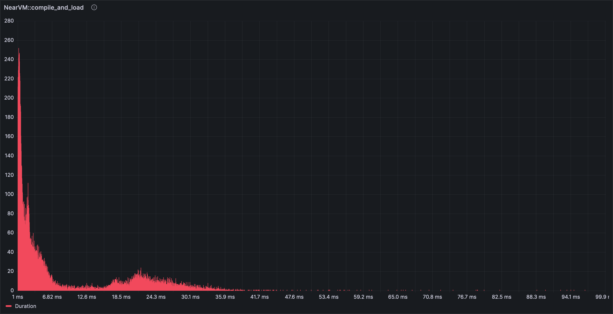
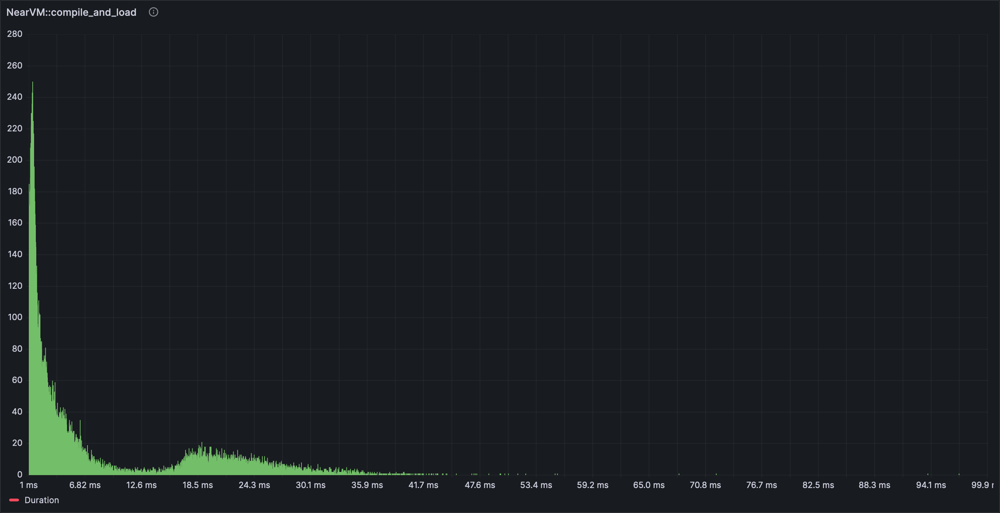

# Working with OpenTelemetry Traces

`neard` is instrumented in a few different ways. From the code perspective we have two major ways
of instrumenting code:

* Prometheus metrics – by computing various metrics in code and expoding them via the `prometheus`
  crate.
* Execution tracing – this shows up in the code as invocations of functionality provided by the
  `tracing` crate.

The focus of this document is to provide information on how to effectively work with the data
collected by the execution tracing approach to instrumentation.

## Gathering and Viewing the Traces

Tracing the execution of the code produces two distinct types of data: spans and events. These then
are exposed as either logs (representing mostly the events) seen in the standard output of the
`neard` process or sent onwards to an [opentelemetry collector].

[opentelemetry collector]: https://opentelemetry.io/docs/collector/

When deciding how to instrument a specific part of the code, consider the following decision tree:

1. Do I need execution timing information? If so, use a span; otherwise
2. Do I need call stack information? If so, use a span; otherwise
3. Do I need to preserve information about inputs or outputs to a specific section of the code? If
   so, use key-values on a pre-existing span or an event; otherwise
4. Use an event if it represents information applicable to a single point of execution trace.

As of writing (February 2024) our codebase uses spans somewhat sparsely and relies on events
heavily to expose information about the execution of the code. This is largely a historical
accident due to the fact that for a long time stdout logs were the only reasonable way to extract
information out of the running executable.

Today we have more tools available to us. In production environments and environments replicating
said environment (i.e. GCP environments such as mocknet) there's the ability to push this data to
Grafana Loki (for events) and [Tempo] (for spans and events alike), so long as the amount of data
is within reason. For that reason it is critical that the event and span levels are chosen
appropriately and in consideration with the frequency of invocations. In local environments
developers can use projects like [Jaeger], or set up the Grafana stack if they wish to use a
consistent interfaces.

It is still more straightforward to skip all the setup necessary for tracing, but relying
exclusively on logs only increases noise for the other developers and makes it ever so slightly
harder to extract signal in the future. Keep this trade off in mind.

[Tempo]: https://grafana.com/oss/tempo/
[Loki]: https://grafana.com/oss/loki/
[Jaeger]: https://www.jaegertracing.io/


### Spans

We have a [style guide section on the use of Spans](../style.md#spans), please make yourself
familiar with it.

Every `tracing::debug_span!()` creates a new span, and usually it is attached to its parent
automatically.

However, a few corner cases exist.

* `do_apply_chunks()` starts 4 sub-tasks in parallel and waits for their completion. To make it
work, the parent span is passed explicitly to the sub-tasks.
* Messages to actix workers. If you do nothing, that the traces are limited to work done in a
single actor. But that is very restrictive and not useful enough. To workaround that, each actix
message gets attached `opentelemetry::Context`. That context somehow represents the information
about the parent span. This mechanism is the reason you see annoying `.with_span_context()`
function calls whenever you send a message to an actix Actor.
* Inter-process tracing is theoretically available, but I have never tested it. The plan was to
test it as soon as the Canary images get updated 😭 Therefore it most likely doesn’t work. Each
`PeerMessage` is injected with `TraceContext` (1, 2) and the receiving node extracts that context
and all spans generated in handling that message should be parented to the trace from another node.
* Some spans are created using `info_span!()` but they are few and mostly for the logs. Exporting
only info-level spans doesn’t give any useful tracing information in Grafana.

* `actix::Actor::handle()` deserves a special note. The design choice was to provide a macro that
lets us easily annotate every implementation of `actix::Actor::handle()`. This macro sets the
following span attributes:

   * `actor` to the name of the struct that implements actix::Actor
   * `handler` to the name of the message struct

   And it lets you provide more span attributes. In the example, ClientActor specifies `msg_type`,
   which in all cases is identical to `handler`.

## Configuration

[The Tracing documentation page in nearone's
Outline](https://nearone.getoutline.com/doc/tracing-in-grafana-RgJUJZF2C0) documents the steps
necessary to start moving the trace data from the node to Nearone's Grafana Cloud instance. Once
you set up your nodes, you can use the explore page to verify that the traces are coming through.


If the traces are not coming through quite yet, consider using the ability to set logging
configuration at runtime. Create `$NEARD_HOME/log_config.json` file with the following contents:

```json
{ "opentelemetry": "info" }
```

Or optionally with `rust_log` setting to reduce logging on stdout:

```json
{ "opentelemetry": "info", "rust_log": "WARN" }
```

and invoke `sudo pkill -HUP neard`. Double check that the collector is running as well.

Note that the `rust_log` log level has to be higher than the `opentelemetry` level. Traces won't be generated if the logs aren't emitted.\
This wouldn't work because the default `rust_log` level doesn't emit debug logs for runtime:
```json
{ "opentelemetry": "info,runtime=debug,vm=debug"}
```
But this works:
```json
{ "opentelemetry": "info,runtime=debug,vm=debug", "rust_log": "info,runtime=debug,vm=debug" }
```

<blockquote style="background: rgba(255, 200, 0, 0.1); border: 5px solid rgba(255, 200, 0, 0.4);">

**Good to know**: You can modify the event/span/log targets you’re interested in just like when
setting the `RUST_LOG` environment variable, including target filters. If you're setting verbose
levels, consider selecting specific targets you're interested in too. This will help to keep trace
ingest costs down.

For more information about the dynamic settings refer to `core/dyn-configs` code in the repository.

</blockquote>

### Local development

<blockquote style="background: rgba(255, 200, 0, 0.1); border: 5px solid rgba(255, 200, 0, 0.4);">

**TODO**: the setup is going to depend on whether one would like to use grafana stack or just
jaeger or something else. We should document setting either of these up, including the otel
collector and such for a full end-to-end setup. Success criteria: running integration tests should
allow you to see the traces in your grafana/jaeger. This may require code changes as well.

</blockquote>

Using the Grafana Stack here gives the benefit of all of the visualizations that are built-in. Any
dashboards you build are also portable between the local environment and the Grafana Cloud
instance. Jaeger may give a nicer interactive exploration ability. You can also set up both if you
wish.

## Visualization

Now that the data is arriving into the databases, it is time to visualize the data to determine
what you want to know about the node. The only general advise I have here is to check that the data
source is indeed tempo or loki.

### Explore

Initial exploration is best done with Grafana's Explore tool or some other mechanism to query and
display individual traces.

The query builder available in Grafana makes the process quite straightforward to start with, but
is also somewhat limited. Underlying [TraceQL has many more
features](https://grafana.com/docs/tempo/latest/traceql/) that are not available through the
builder. For example, you can query data in somewhat of a relational manner, such as this query
below queries only spans named `process_receipt` that take 50ms when run as part of `new_chunk`
processing for shard 3!

```
{ name="new_chunk" && span.shard_id = "3" } >> { name="process_receipt" && duration > 50ms }
```

<blockquote style="background: rgba(255, 200, 0, 0.1); border: 5px solid rgba(255, 200, 0, 0.4);">

**Good to know**: When querying, keep in mind the "Options" dropdown that allows you to specify the
limit of results and the format in which these results are presented! In particular, the
"Traces/Spans" toggle will affect the durations shown in the result table.

</blockquote>

Once you click on a span of interest, Grafana will open you a view with the trace that contains
said span, where you can inspect both the overall trace and the properties of the span:


### Dashboards

Once you have arrived at an interesting query, you may be inclined to create a dashboard that
summarizes the data without having to dig into individual traces and spans.

As an example the author was interested in checking the execution speed before and after a change
in a component. To make the comparison visual, the span of interest was graphed using the histogram
visualization in order to obtain the following result. In this graph the Y axis displays the number
of occurrences for spans that took X-axis long to complete.

<div id="image-comparison">


</div>
<style>
#image-comparison {
    position: relative;
}
#image-comparison>.before {
    position: absolute;
    top: 0;
    left: 0;
    z-index: 1;
    opacity: 0;
    transition: opacity 250ms;
}
#image-comparison>.before:hover {
    opacity: 1;
}
</style>

In general most of the panels work with tracing results directly but some of the most interesting
ones do not. It is necessary to experiment with certain options and settings to have grafana panels
start showing data. Some notable examples:

1. Time series – a “Prepare time series” data transformation with “Multi-frame time series” has to
   be added;
2. Histogram – make sure to use "spans" table format option;
3. Heatmap - set “Calculate from data” option to “Yes”;
4. Bar chart – works out of the box, but x axis won't be readable ever.

You can also add a panel that shows all the trace events in a log-like representation using the log
or table visualization.

### Multiple nodes

One frequently asked question is whether Grafana lets you distinguish between nodes that export
tracing information.

The answer is yes.

In addition to span attributes, each span has resource attributes. There you'll find properties
like `node_id` which uniquely identify a node.

* `account_id` is the `account_id` from `validator_key.json`;
* `chain_id` is taken from `genesis.json`;
* `node_id` is the public key from `node_key.json`;
* `service.name` is `account_id` if that is available, otherwise it is `node_id`.
